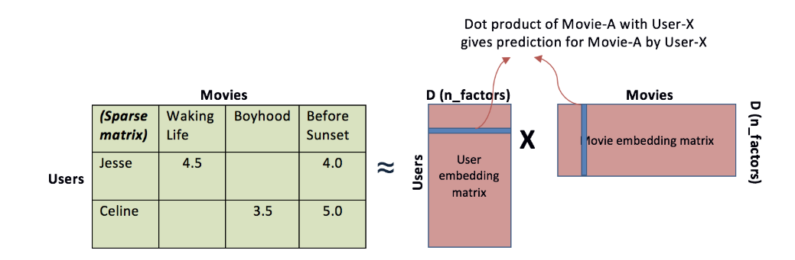
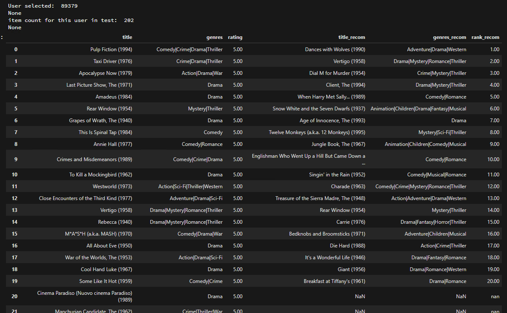
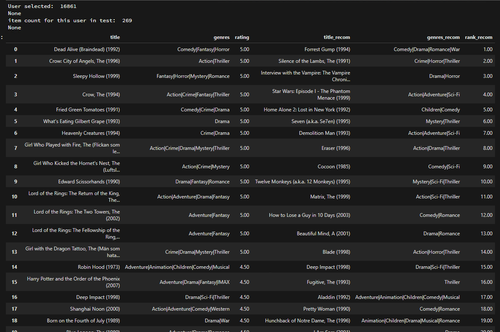
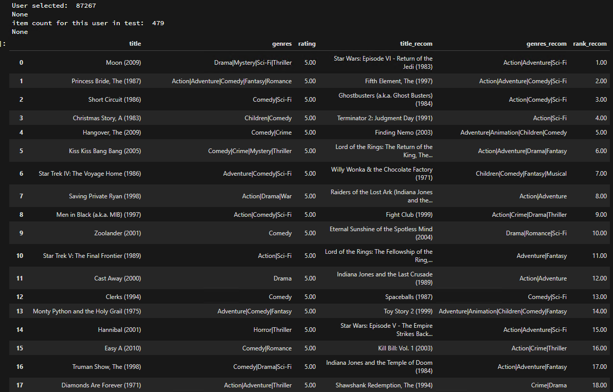

# Movie Recommender project

This project involves recommending top K movies based on a training file with existing ratings by user for a movie.  It uses the [Movielens 20M Dataset](https://grouplens.org/datasets/movielens/20m/) for a list of existing user-item ratings.


# Packages and technologies used

**[Turicreate](https://github.com/apple/turicreate)**: open-source machine-learning/deep-learning framework that is task-oriented. 

**scikit-learn:**  

# Data loading and cleaning
Following are two datasets used:
```
/ratings.csv
/movies.csv
```
To reduce sparsity, any movie with less than 50 ratings are removed.


# Training Approach

Matrix Factorization is used to create latent factors (embeddings) for items and users. Here is a visualization of how the item-user matrix can be converted into lower dimensional user and item matrices.



To reduce the training time, only 10% of the data is selected for training.

The training is done assuming a binary target. So the ratings are converted into boolean (like/dislike) categories, i.e., if rating < 3.5 then 0 (dislike), else 1 (like). 

A Hyperparameter search is conducted using scikit-learn-compatible estimator (RandomizedSearchCV) on a 3-fold cross-validation F1 score of the top 10 recommendation for each user, and the best parameters are selected to train the final model. A total of 18 combinations of parameters are passed for the hyperparameter search. The best estimates might look something like this:
```
Best Parameters: {'regularization': 0.001, 'num_factors': 10, 'linear_regularization': 1.0}
Best Mean Cross-validated f1: 0.0196946800956

```

# Model Evaluation

From the list of 'test' users, top 10 recommended movies from the model is selected. This is compared against the list of movies those users actually liked. Based on this, we calculate recall, precision and F1-scores. 

Here are the evaluation metrics:
```
recall: 0.08
precision: 0.01
F1: 0.02
```
Here are some actual examples of actual movies seen by the users, vs. the recommendations. First 3 columns are actual Movies sorted by highest rating. Next 3 columns are top recommendations sorted by Rank (recommendaiton scores).
 
>In this example, the user has rated highly the movies from 1950s to 1990s. We see that the recommendations are for movies from 1950s to 1990s.


>In this example, the user has rated highly Drama, Thriller or Horror movies from the 1990s. We see that the recommendations are also for similar movies from the 1990s.


>In this example, the user's preference for Sci-Fi movies is reflected in the top recommendations,



# Limitations of this approach

* Only used 10% of data for training, to make the process run faster.

* The evaluation scores (precision and recall) are not very large. One reason could be that the training examples were removed from the recommendations on the test dataset.

* This project does not explicitly address the cold-start issue. TO address this issue, another model for Item-similarity can be built, and the most popular item can be recommended for new users. Also, Item-User attributes can be taken into account to address cold-start issues.


# Conclusion

This collaborative-filtering recommendation was built based on Matrix Factorization approach. The ratings 1-5 are converted into boolean targets (like/dislike). A hyperparamter search is conducted on scikit-learn-compatible estimator. 

The evaluation metrics are not as high as expected, however, there are indications that the recommendations make sense, and are sensible.


  
# References

[Recall and Precision at k for Recommender Systems](https://medium.com/@m_n_malaeb/recall-and-precision-at-k-for-recommender-systems-618483226c54

[Recommender Systems](https://github.com/apple/turicreate/tree/master/userguide/recommender)

[turicreate.recommender.ranking_factorization_recommender](https://apple.github.io/turicreate/docs/api/generated/turicreate.recommender.ranking_factorization_recommender.RankingFactorizationRecommender.html?highlight=rankingfactorization#turicreate.recommender.ranking_factorization_recommender.RankingFactorizationRecommender)


